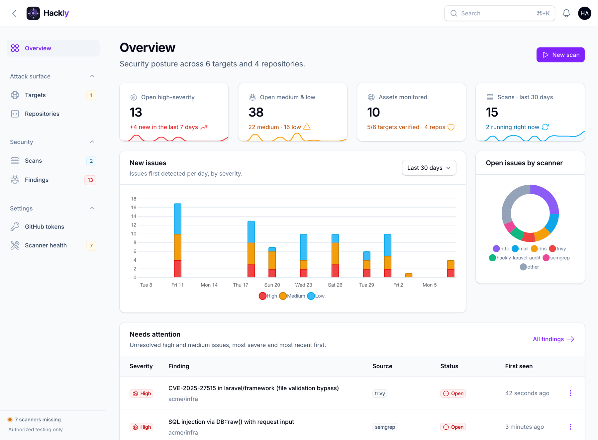
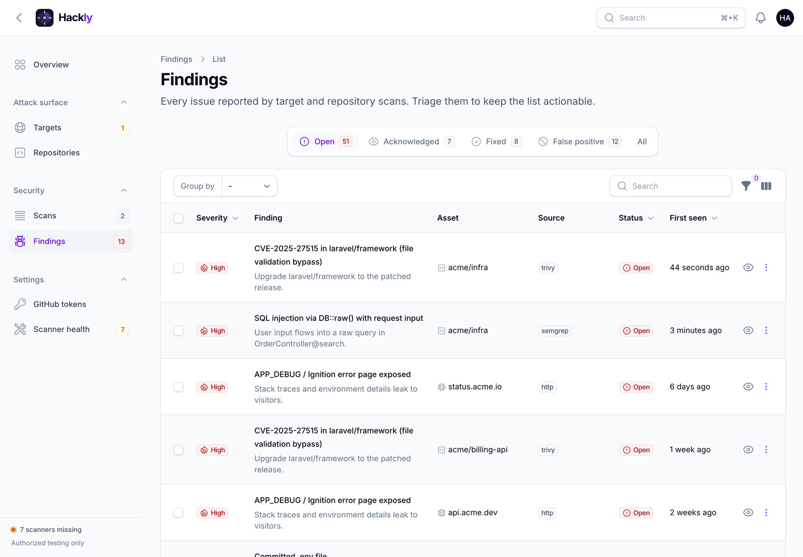
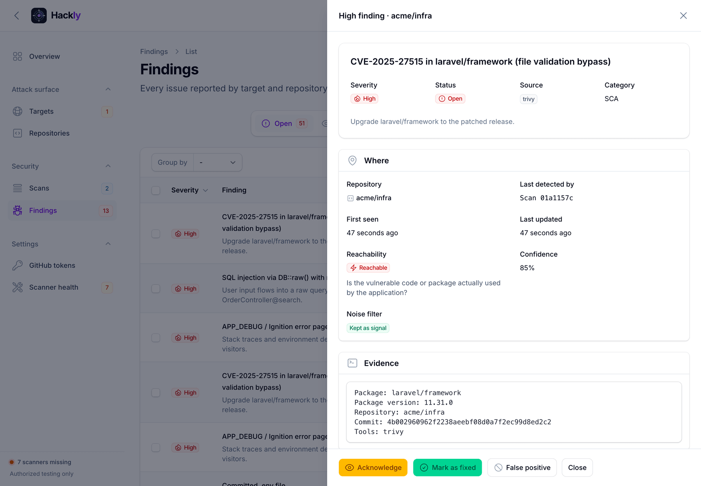
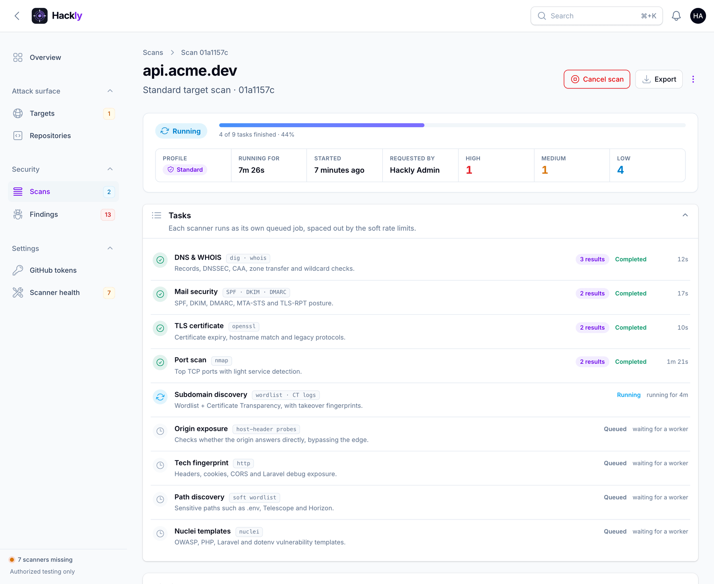
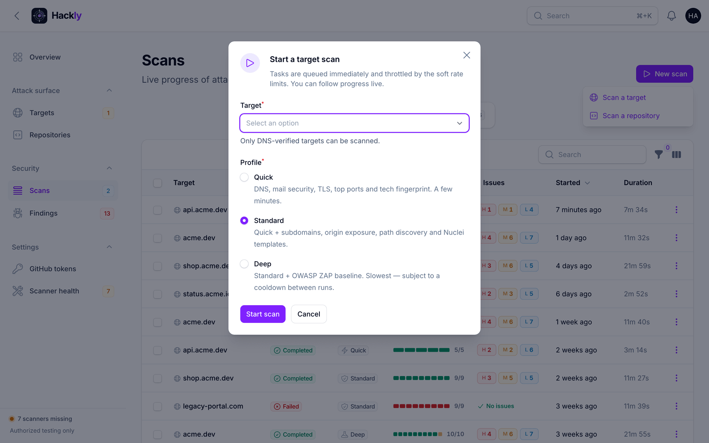
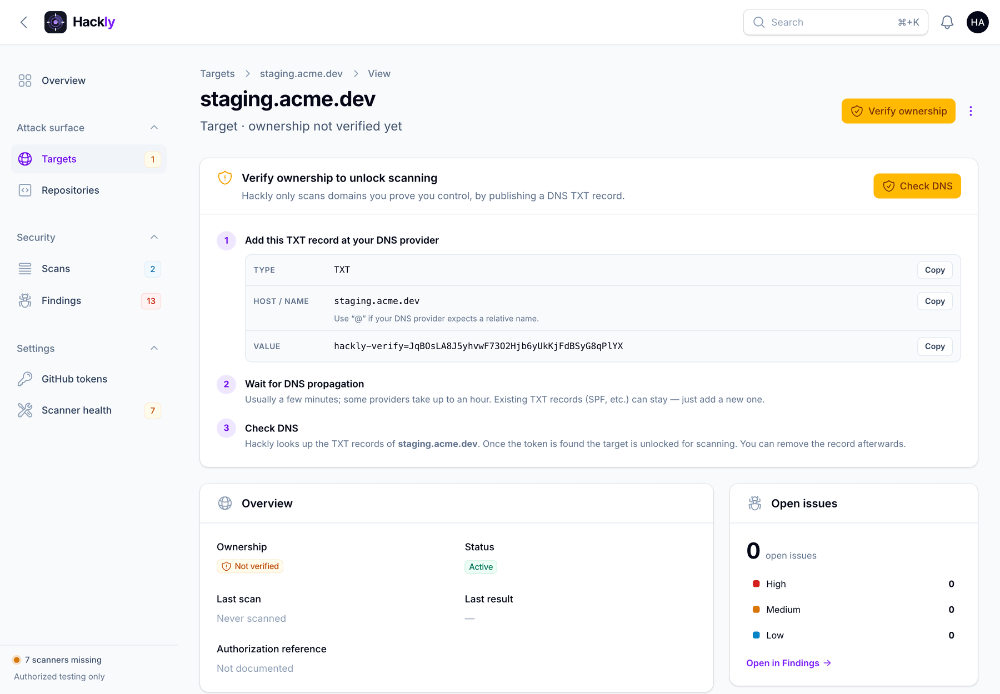
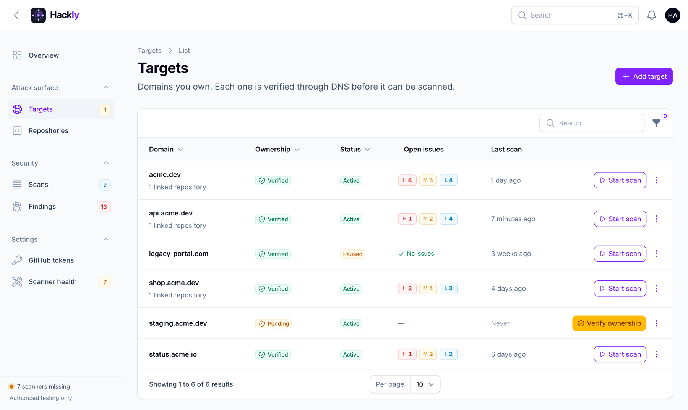
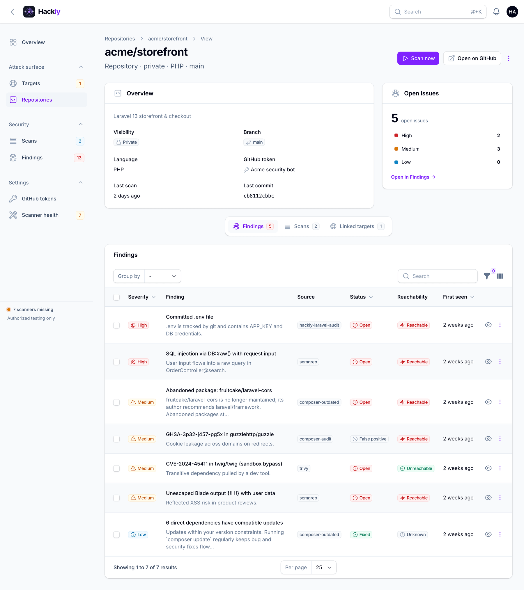
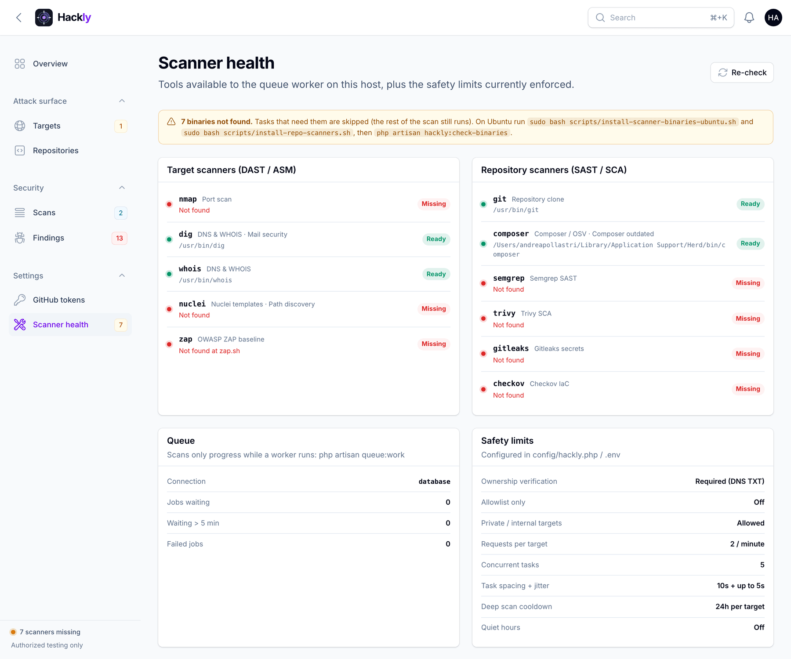
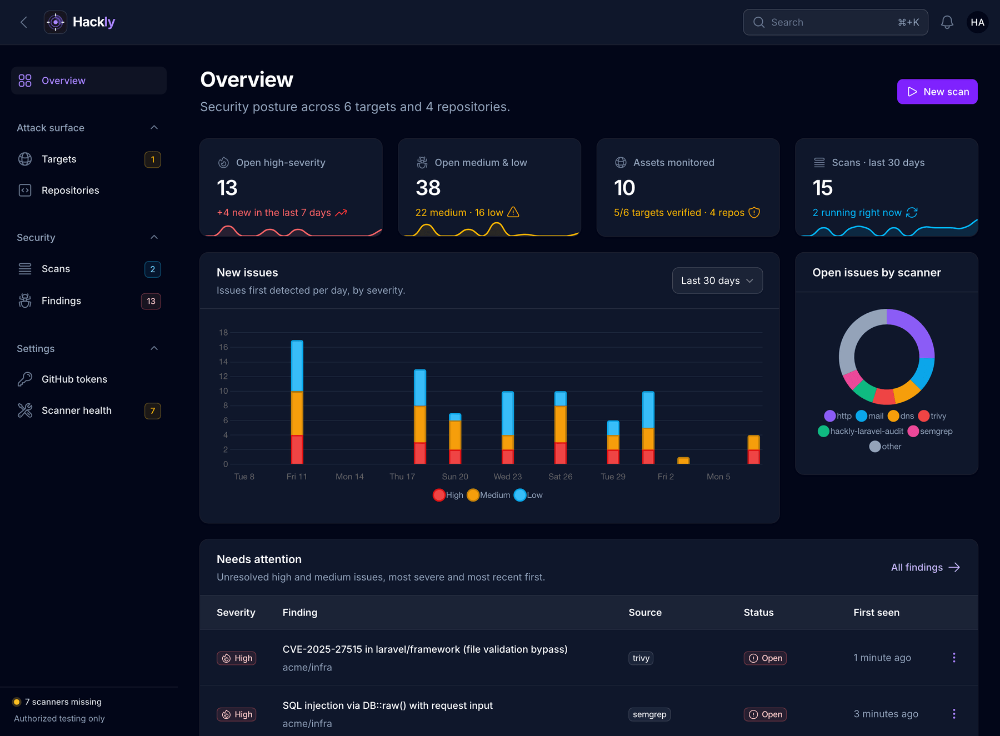

<p align="center">
  
</p>

<h1 align="center">Hackly</h1>

<p align="center">
  <strong>Self-hosted attack-surface &amp; application security scanning — built for Laravel teams.</strong><br>
  Prove you own it, scan it, triage what matters. Domains and GitHub repositories in one calm dashboard.
</p>

<p align="center">
  
  
  
  
</p>

<p align="center">
  <a href="#quick-start">Quick start</a> ·
  <a href="#feature-tour">Feature tour</a> ·
  <a href="#what-it-scans">What it scans</a> ·
  <a href="#configuration">Configuration</a> ·
  <a href="#security-model">Security model</a>
</p>

<p align="center">
  
</p>

> [!IMPORTANT]
> **Only scan targets and repositories you are authorized to assess.** Unauthorized scanning may be illegal. Hackly enforces DNS ownership verification before any target scan can start.

---

## Why Hackly

- **Ownership first.** Every domain is verified with a DNS TXT record before a single packet is sent. No verification, no scan.
- **One place for DAST and SAST.** Attack-surface scans for your domains and SAST / SCA / secrets scans for your GitHub repositories — linked together when they belong to the same app.
- **Findings you can act on.** Severity-ranked, deduplicated, with reachability for PHP code. Acknowledge, fix or dismiss them — decisions survive the next scan.
- **Gentle by default.** Soft rate limits, jitter, task spacing, quiet hours and a deep-scan cooldown keep you off WAF ban lists.
- **Open-source tools, orchestrated.** `nmap`, `nuclei`, OWASP ZAP, Semgrep, Trivy, Gitleaks, Checkov, `composer audit` / `outdated` and OSV — Hackly runs them, normalizes the output and keeps the history.
- **Self-hosted.** Your targets, tokens and findings never leave your server. GitHub tokens are encrypted at rest.

---

## Feature tour

### Triage findings, not noise

Every issue from every scanner lands in one list, ranked High → Low. Work through the **Open** tab, then acknowledge, mark as fixed or flag false positives — one by one or in bulk. Passed checks are hidden unless you ask for them.

<p align="center"></p>

Open any finding in a slide-over to see where it lives, which scan last detected it, CVE links, PHP reachability and the raw evidence — and triage it without leaving the list.

<p align="center"></p>

### Watch scans run live

Each scanner runs as its own queued job. The scan page shows progress, duration and results per task as they happen — and tells you when a task was skipped because a tool is missing, or when no queue worker is picking up jobs. Cancel a scan, run it again, or export a **PDF / Markdown** report.

<p align="center"></p>

### Start scans from anywhere

Pick a target or a repository, choose a profile — every profile explains what it runs — and optionally include linked assets.

<p align="center"></p>

### Ownership verification, guided

Add a domain and Hackly shows exactly which TXT record to publish, with copy buttons. Reopening the dialog never invalidates a record you already published.

<p align="center"></p>

### Every asset at a glance

Targets and repositories show open issues by severity, last scan and ownership status. Each one has its own page with findings, scan history and linked assets.

<p align="center"></p>

<p align="center"></p>

### Know your scanner coverage

**Scanner health** lists which binaries the worker can actually run, what each one powers, the state of the queue and every safety limit in force.

<p align="center"></p>

### And the rest

- **Dark mode** that is actually designed, not inverted.
- **In-app notifications** when a scan you started finishes, with a one-line severity summary.
- **Global search** (<kbd>⌘</kbd> / <kbd>Ctrl</kbd> + <kbd>K</kbd>) across targets, repositories and findings.
- **Two-factor authentication** with authenticator apps (with recovery codes) or email codes.
- **Getting-started checklist** on the dashboard until your first target and repository are scanned.

<p align="center"></p>

---

## Quick start

```bash
git clone https://github.com/andreapollastri/hackly.git && cd hackly
composer install
cp .env.example .env
php artisan key:generate
touch database/database.sqlite
php artisan migrate --seed
```

Want to look around before scanning anything? Load a fictional demo workspace (targets, repositories, scans and findings — nothing touches the network):

```bash
php artisan db:seed --class=DemoSeeder
```

Run the app and a queue worker:

```bash
composer run dev            # serve + queue + logs + vite, all at once
```

or separately:

```bash
php artisan serve
php artisan queue:work      # required — scans only progress while a worker runs
php artisan schedule:work   # optional: hourly cleanup of raw scanner output
```

Sign in at `/` with:

| Email | Password |
|-------|----------|
| `admin@hackly.test` | `password` |

> Change the seeded password immediately (user menu → **Profile**) and enable two-factor authentication.

No Node build is needed: Filament ships its compiled assets and Hackly's panel styles are plain CSS in [`public/css/hackly.css`](public/css/hackly.css).

---

## What it scans

### Target scanners (DAST / attack surface)

| Task | Tool | Profiles |
|------|------|----------|
| DNS & WHOIS | `dig`, `whois` (+ DNSSEC, CAA, AXFR, wildcard) | quick · standard · deep |
| Mail security | SPF / DKIM / DMARC / MTA-STS / TLS-RPT | quick · standard · deep |
| TLS certificate | expiry, hostname, legacy protocols | quick · standard · deep |
| Port scan | `nmap` | quick · standard · deep |
| Tech fingerprint | headers, cookies, CORS, `APP_DEBUG` | quick · standard · deep |
| Subdomain discovery | wordlist + CT logs + takeover fingerprints | standard · deep |
| Origin exposure | direct-IP Host-header probes | standard · deep |
| Path discovery | soft wordlist / Nuclei (Laravel exposures) | standard · deep |
| Nuclei templates | `nuclei` (+ laravel/php/dotenv tags) | standard · deep |
| OWASP ZAP baseline | ZAP (calibrated severities) | deep |

### Repository scanners (Laravel / PHP)

| Task | Tool | Profiles |
|------|------|----------|
| Secrets | `gitleaks` | quick · standard · deep |
| Composer / CVE | `composer audit` + [OSV](https://osv.dev) | quick · standard · deep |
| Dependency health | `composer outdated --locked` — abandoned packages, direct deps a major behind, Laravel out of security support | standard · deep |
| Laravel PHP audit | Hackly static checks on the clone | quick · standard · deep |
| SAST | `semgrep` (`p/php`) | standard · deep |
| SCA | `trivy` | standard · deep |
| IaC | `checkov` (when Docker / Terraform / Actions are present) | deep |
| Laravel live pentest | live probes on **linked** targets | standard · deep\* |

\* Only when the scan is started with **Also deep-scan linked targets**.

**Post-processing of repository findings**

- Cross-tool **deduplication** (the same `package + CVE` from Trivy and OSV becomes one finding)
- **PHP reachability**: namespace usage in `app/`, `routes/`, `config/`…; `require-dev` → unreachable; Laravel package auto-discovery
- **Noise filters**: placeholder secrets, paths outside the app, configurable rule suppressions
- **Dependency health** stays quiet on purpose: compatible (minor / patch) updates are rolled into a single Low finding instead of one row per package
- Findings keep `reachability`, `confidence`, `noise_filtered` and the list of tools that reported them

### Finding lifecycle

| Status | Meaning |
|--------|---------|
| **Open** | Reported by the latest scan and not triaged yet |
| **Acknowledged** | Someone owns it; it stays visible in “Needs attention” |
| **Fixed** | Marked fixed by you — target findings are also closed automatically when a later scan of the same checks no longer reports them |
| **False positive** | Dismissed — re-detection keeps it dismissed |

A finding marked *Fixed* that shows up again is reopened automatically, so regressions surface on their own.

---

## How it works

```
Target (DNS-verified)                 Repository (GitHub token)
   │                                      │
   ├──── optional link ───────────────────┤
   │                                      │
   ├─ Scan (DAST)                         ├─ Repository scan
   │    └─ tasks → findings               │    └─ clone → tasks → dedupe / reachability → findings
   │                                      │
   └─ “also scan linked repositories”     └─ “also deep-scan linked targets”
```

| Mode | Behaviour |
|------|-----------|
| Target only | DAST profile quick / standard / deep — no repository work |
| Target + repositories | Target DAST **and** a scan of every linked repository |
| Repository only | Clone + SAST / SCA / secrets / … — no DAST, no live pentest |
| Repository + targets | Repository scan **and** a deep DAST scan of every linked, verified target |

Jobs run on the **database queue** (no Horizon needed). A queue worker must be running for scans to make progress — the scan page warns you when nothing has picked up a task.

---

## Requirements

- PHP **8.3+** and Composer
- SQLite *(default)*, MySQL or PostgreSQL
- `git` for repository clones
- Node.js — optional, only for the Vite dev server

### Target scanner binaries *(recommended)*

| Binary | Used for |
|--------|----------|
| `dig`, `whois` | DNS & WHOIS, mail security |
| `nmap` | Port scan |
| `nuclei` | Nuclei templates, path discovery |
| OWASP ZAP (`zap.sh`) | Deep DAST baseline |

```bash
sudo bash scripts/install-scanner-binaries-ubuntu.sh
```

### Repository scanner binaries

| Binary | Used for |
|--------|----------|
| `semgrep` | PHP SAST |
| `trivy` | SCA |
| `gitleaks` | Secrets |
| `checkov` | IaC |
| `composer` | `composer audit`, `composer outdated` |

```bash
sudo bash scripts/install-repo-scanners.sh   # Ubuntu 24.04 / 26.x, non-interactive
php artisan hackly:check-binaries
```

Missing binaries make the tasks that need them **skip** — the rest of the scan still runs. **Settings → Scanner health** shows what is available on the worker host and how to fix what is not.

---

## Usage

### Targets

1. **Targets → Add target** — enter a domain (pasting a URL is fine, it is normalized).
2. Publish the TXT record shown on the target page at your DNS provider.
3. **Check DNS** — once the token is found, the target is unlocked.
4. **Start scan** — pick *Quick*, *Standard* or *Deep*; optionally include linked repositories.
5. Follow the scan live, then triage its findings or export a PDF / Markdown report.

### GitHub repositories

1. **Settings → GitHub tokens → Add token** (or create one inline while adding a repository).
2. **Repositories → Add repository** — `owner/repo` or a `github.com` URL; metadata is fetched from GitHub.
3. Optionally link the targets the code is deployed on.
4. **Scan now** — pick a profile; optionally deep-scan the linked targets as well.

#### GitHub token permissions

| Token type | Permissions |
|------------|-------------|
| **Fine-grained** *(recommended)* | Only the repositories you scan · **Contents: Read** · **Metadata: Read** |
| Classic | `repo` for private repositories, `public_repo` for public ones |

### Scans from the CLI

Scans are always started on demand — there is no automatic recurring scan schedule.

| Goal | UI | CLI |
|------|----|-----|
| Target only | Start scan | `php artisan hackly:scan example.com --profile=standard` |
| Target + linked repositories | Start scan → *Also scan linked repositories* | `php artisan hackly:scan example.com --include-repos` |
| Repository only | Scan now | `php artisan hackly:repo-scan owner/repo` |
| Repository + linked targets | Scan now → *Also deep-scan linked targets* | `php artisan hackly:repo-scan owner/repo --include-targets` |

### Commands

| Command | Purpose |
|---------|---------|
| `hackly:check-binaries` | Verify scanner binaries (target + repository tools) |
| `hackly:scan {target} --profile=standard` | Target scan; optional `--include-repos` |
| `hackly:repo-scan {owner/repo} --profile=standard` | Repository scan; optional `--include-targets` |
| `hackly:cleanup-outputs` | Delete old raw scanner output |
| `hackly:dispatch-due` | Re-dispatch leftover pending tasks |
| `queue:work` | Process scan jobs |
| `schedule:work` / cron `schedule:run` | Hourly cleanup of old output (optional) |

---

## Configuration

Primary config: [`config/hackly.php`](config/hackly.php), overridable from `.env`. The values in force are visible under **Settings → Scanner health**.

```env
QUEUE_CONNECTION=database
CACHE_STORE=database

# Safety
HACKLY_ALLOWLIST_ONLY=false
HACKLY_ALLOWLIST=example.com,203.0.113.10
HACKLY_ALLOW_PRIVATE_TARGETS=true

# Soft rate limits
HACKLY_PER_TARGET_PER_MINUTE=2
HACKLY_GLOBAL_CONCURRENT=5
HACKLY_JITTER_SECONDS=5
HACKLY_TASK_SPACING_SECONDS=10
HACKLY_DEEP_COOLDOWN_HOURS=24
HACKLY_QUIET_HOURS_ENABLED=false

# Job timeout must exceed the longest scanner (ZAP ~900s)
HACKLY_JOB_TIMEOUT=960
DB_QUEUE_RETRY_AFTER=1020

# Binary paths (examples)
HACKLY_NMAP=nmap
HACKLY_NUCLEI=nuclei
# Writable HOME for nuclei when the queue user cannot write the app directory:
# HACKLY_NUCLEI_HOME=/path/to/storage/app/nuclei-home
# macOS:
# HACKLY_ZAP=/Applications/ZAP.app/Contents/Java/zap.sh
HACKLY_ZAP=zap.sh

# GitHub repository scanning
HACKLY_GIT=git
HACKLY_COMPOSER=composer
HACKLY_SEMGREP=semgrep
HACKLY_TRIVY=trivy
HACKLY_GITLEAKS=gitleaks
HACKLY_CHECKOV=checkov
# HACKLY_SEMGREP_CONFIG=p/php
# HACKLY_OSV_ENABLED=true
# HACKLY_REPO_HIDE_UNREACHABLE=false
# HACKLY_REPO_DROP_NOISE=false
```

### Production checklist

- `HACKLY_ALLOW_PRIVATE_TARGETS=false`
- Prefer `HACKLY_ALLOWLIST_ONLY=true` with an explicit allowlist
- Configure real mail (`MAIL_MAILER=…`) for email two-factor codes
- Change the seeded admin password and enable two-factor authentication
- Add GitHub tokens only through **Settings → GitHub tokens** (encrypted with `APP_KEY`)
- Run both install scripts on the worker host, then check **Scanner health**
- Keep a supervised `queue:work` process running

---

## Security model

- **Target** scans require DNS TXT **ownership verification**
- **Repository** scans require a GitHub token with read access to that repository
- Linking targets ↔ repositories is optional; each can be scanned on its own
- Optional **allowlist** and private / internal IP blocking for targets
- Soft **rate limits**, **jitter**, **task spacing**, **quiet hours** and a **deep-scan cooldown**
- Admin accounts support **TOTP** (with recovery codes) and **email** two-factor authentication
- Repository clones are deleted after each scan when `HACKLY_REPO_CLEANUP=true` (default)

Hackly is an orchestration layer — it does not replace responsible disclosure policies or scoped pentest agreements. PHP reachability analysis is heuristic (a strong signal for Laravel apps), not an interprocedural guarantee.

---

## Development

```bash
php artisan test                         # feature + unit tests (renders every panel page)
php artisan db:seed --class=DemoSeeder   # fictional demo workspace
./vendor/bin/pint                        # code style
```

The screenshots in this README are taken from the demo workspace. All names, domains and findings in it are fictional.

## License

MIT
